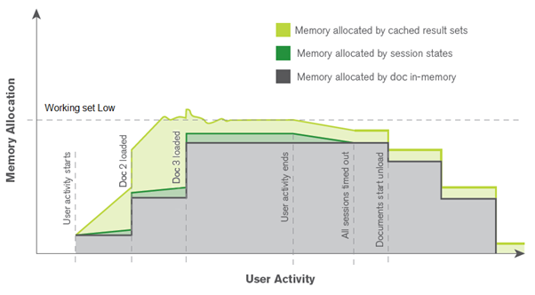
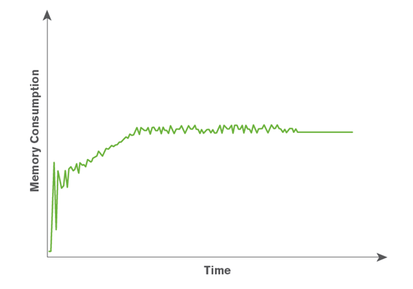
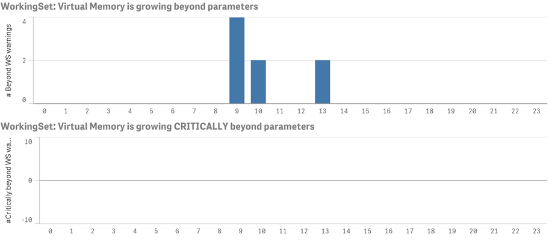
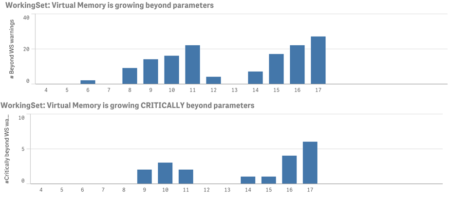

# QIX Engine documentation

This page describes a subset of the QIX Engine features that are commonly
used in a containerized environment.

## Monitoring and scaling

QIX Engine has some unique resource characteristics, which are presented
here along with some ways to monitor the QIX Engine for health and scaling
purposes.

### QIX Engine memory management

The main memory RAM is the primary
storage for all data to be analyzed by QIX Engine. The engine mainly
allocates memory for:

* The unaggregated dataset that is defined by the document data model.
* The aggregated data (that is, cached result sets) and the calculations
  defined by the user interface.
* The session state for each user of the document.
* Temporary allocations for helper tables during calculations.

When a user requests a document, QIX Engine loads it into memory, if it
has not been previously loaded. The dataset for a document is only loaded
once and is not duplicated for multiple users who concurrently access and
analyze it. As the user makes selections in the document, QIX Engine
performs the needed calculations in real time. To render a chart, the
QIX engine must first access the core unaggregated dataset and then calculate
and store the totals. The user session states and aggregates are stored
in the RAM above and beyond the RAM used to store the core unaggregated
dataset. Most of the session information is shared between sessions in
the same state. Aggregates are shared across all users in a central cache.

### Controlling the allocation of memory

There are two fundamental settings for controlling how QIX Engine
allocates and releases memory:

* Working set Low / Min memory usage: This setting defines the amount of
  memory that QIX Engine will use. Prior to this point, the QIX Engine will
  not try to minimize its allocation of memory. For example, if the
  physical RAM on your server is 256 GB and Working set Low / Min memory
  usage is set to 70%, the QIX Engine will not try to minimize its memory
  allocation until 179.2 GB of RAM is used. On the other hand, the QIX Engine
  will not use any memory if it is not used for a beneficial purpose and
  employs compression algorithms to minimize the memory consumption.
* Working set High / Max memory usage: This setting is the point above
  which QIX Engine cannot allocate any memory. Obviously, Working set
  Low / Min memory usage must be lower than Working set High / Max memory
  usage and leave enough room for handling of transients (that is, the
  amount of RAM temporarily allocated while the QIX Engine purges cached
  result sets) without reaching Working set High / Max memory usage in
  an environment. For example, if the physical RAM on your server is 256
  GB and Working set High / Max memory usage is set to 90%, the QIX Engine
  cannot allocate any RAM above 230.4 GB.

It is recommended to leave these settings with their default values.
However, on servers with large RAM (256 GB and upwards), the settings can
be changed to allocate a couple of GBs of RAM for the operating system and
allow the remaining RAM to be used by QIX Engine.

QIX Engine depends on
the operating system to allocate RAM for it to use. When the QIX Engine starts,
it attempts to reserve RAM based on the Working set Low / Min memory usage
setting. The QIX Engine allocates all allowed memory with cached results sets
as quickly as possible, but this does not mean that the QIX Engine will lack
in performance once the allowed amount of memory is reached. If the allowed
amount of RAM is exceeded, the QIX Engine purges cached result sets to make
place for new documents, calculated aggregates, and session state information.
This means that an environment can operate on the boundary of the Working
set Low / Min memory usage setting without impacting the user-perceived
performance as long as there are old result sets that can be purged. The
prioritization of which result sets to purge is based on the age, size,
and time of calculation of the result sets currently in the cache.

If the RAM becomes scarce, the operating system may, at its discretion,
perform paging, which means that some of the QIX Engine memory is swapped
from physical RAM to Virtual Memory (that is, secondary storage). When the
QIX Engine is allocated Virtual Memory it may become orders of magnitude slower
than when using 100% RAM. This is undesirable and may lead to poor user
experience. Note that this is not unique to QIX Engine as the RAM is handled
by the operating system. There is no guarantee that such paging will not
occur between the Working set Low / Min memory usage setting and the Working
set High / Max memory usage setting, but above the Working set High / Max
memory usage setting paging will definitively occur.

### Example: Allocation of memory when loading a single document

The following figure shows an example of the memory allocation by QIX Engine
over time when a clean server is started and users begin to interact with a
document. The document is first loaded into memory, which corresponds to a
peak in memory consumption. Whilst the users continue to interact with the
document, result sets from requested calculations are stored in RAM.
Additional requests for already cached result sets can then be served
without any additional calculations. The QIX Engine must also keep track of
the state of each active user session, but the portion of RAM allocated for
that is small in comparison to the memory allocated for the document and
its cached result sets.


QIX Engine does not allow persistent allocation of more memory than specified
by the Working set Low / Min memory usage setting. When the total amount of
allocated RAM goes beyond that setting, previously cached result sets are
purged to make room for new ones. When the document is unloaded from memory,
the total amount of allocated memory drops by the same amount as was originally
allocated by the document. If there are no requests to use the allocated memory,
the cached result sets stay in memory since there is no reason to remove result
sets that might be useful later on.

A QIX Engine session is considered dropped once there are no more connected
websockets to it, and the session TTL has lapsed (TTL is by default 0).

### Example: Allocation of memory when loading multiple documents

The following figure shows how multiple documents can fit into RAM, even
when the total amount of allocated memory touches the Working set Low /
Min memory usage limit. This is achieved by purging cached result sets, so
that memory is released to load new documents. The amount of RAM that can
be used for the cached result sets can be seen as a floating amount between
the Working set Low / Min memory usage setting and the amount consumed by
the documents and session state information.



### Investigating memory usage

It is good practice to investigate how QIX Engine uses memory with your data
models and documents. When the memory curve fluctuates a lot, it usually means
that the Engine needs to allocate extra memory during a calculation. The memory
is released when the result set is cached. Jitter on the memory curve might
indicate poor document design that may be worth investigating as it often means
slow response times.



### Summary of QIX Engine memory management

The following is important to consider when it comes to memory management:

* QIX Engine caches all result sets as long as there is RAM available for
  allocation.
* QIX Engine will only release memory when unloading documents. When a document
  is unloaded from memory, the total amount of allocated memory drops by the
  same amount as originally allocated by the document. If there are no requests
  to use the allocated memory, the cached result sets will stay in memory since
  there is no reason to remove result sets that might be useful later on.
* When the Working set Low / Min memory usage limit is reached, old sessions
  and cached results are purged to make room for new values.
* The age, size, and time of calculation are factors in the prioritization
  of which values to purge.
* QIX Engine purges old sessions when the “maximum inactive session time”
  value is reached.
* High memory usage is usually the result of many cached results. As long
  as paging does not occur, high memory usage is a good thing.

## QIX Engine CPU utilization and scaling over cores

QIX Engine leverages the processor to dynamically create aggregations as
needed in real time, which results in a fast, flexible, and intuitive user
experience.

The data stored in RAM is the unaggregated granular data. Typically, no
pre-aggregation is done when the data is reloaded or a script is executed
for a document. When the user interface requires aggregates (for example,
to display a chart object or to recalculate after a selection has been made),
the aggregation is done in real time, which requires CPU processing power.
QIX Engine is multi-threaded and optimized to take advantage of multiple
processor cores. All available cores are used almost linearly when calculating
charts. During calculations, the Engine makes a short burst of intense CPU
usage in real time. It is good if the CPU utilization is high during peaks
over time (see the figure below). This indicates that the document is designed for
good scaling over cores. A certain selection or calculation can be assumed
to require a certain amount of processing capacity (that is, clock cycles
from a certain chip), and a peak of high utilization results in faster response
times as all available cores can cooperate to complete the calculation. QIX
Engine has a central cache function, which means that chart calculations only
need to be done once, which results in better user experience (that is, faster
response times) and lower CPU utilization.


If a server has high CPU utilization on average (>70%), incoming selections
have to be queued prior to being calculated as there is no processing capacity
immediately available (see the figure below). This is an indication of poor
performance.

The cases where QIX Engine will not scale well over cores include:

* A single user triggers single-threaded operations.
* The underlying hardware does not allow for good scaling (for example, when
  the memory bus is saturated).


### Summary of QIX Engine CPU utilization and scaling over cores

The following is important to consider when it comes to how QIX Engine utilizes
the CPU:

* Peaks with 100% CPU utilization are good as they indicate that QIX Engine
  utilizes all available capacity to deliver the responses as fast as possible.
* High average CPU utilization (>70%) is bad as it means that the system
  saturates and incoming selections in documents have to be queued prior to
  being served.
* QIX Engine processing capacity can be increased by adding more cores or by
  increasing the clock frequency. More processing capacity makes the Engine
  handle load peaks in a robust manner.

## Linear scaling of QIX Engine resources

QIX Engine consumes approximately the same amount of resources when documents
are loaded and accessed at the same time on a server as when they are loaded
and accessed in sequence on the server. So, by adding up the resource usage
of individual documents, you can get a close approximation of the resources
(that is, CPU and memory) needed when loading all of the documents in parallel.
In addition, the throughput is similar (as long as the CPU does not become
saturated) no matter if the documents are loaded in parallel or in sequence.

Note, however, that the average response times are likely to be longer when
the documents are loaded in parallel. This is because the processing requests
from the documents compete and are queued.

This linear scaling provides predictability when managing documents in a
shared environment: by examining the resource usage of individual documents,
you can get an estimate of the total amount of resources needed to load and
access the documents at the same time.

### Summary of linear scaling of QIX Engine resources

The following is important to consider when it comes to linear scaling:

* No matter if documents are loaded and accessed in parallel or in sequence
  on a specific server, they consume approximately the same amount of resources
  and provide the same throughput (as long as the CPU does not become saturated).
* The average response times are likely to be longer when the documents are
  loaded in parallel. This is because the processing requests from the documents
  compete and are queued.

## Frequency analysis of warnings to determine RAM saturation

It can be difficult to determine how much or what portion of the memory
is used for what purpose by the QIX Engine (for example, memory may be
allocated for application in-memory or cached result sets). Apart from
typical end user signs of RAM saturation such as slow response times caused
by slow calculations and frequent recalculations, the QIX log can be used
to identify RAM saturation.

The following warnings should be monitored in the logs:

* WorkingSet: Virtual Memory is growing beyond parameters…
* WorkingSet: Virtual Memory is growing CRITICALLY beyond parameters…

The first warning ("...growing beyond parameters...") indicates that the
QIX Engine experiences problems staying below the Low / Min memory setting.
It is not a problem if this happens every now and then, but depending on the
frequency these warnings may indicate a shortage of RAM.

The second warning ("...CRITICALLY beyond parameters...") is more severe.
This indicates that paging is most likely to happen and the QIX Engine has
not managed to get back below the Low / Min setting for some time. If this
is a reoccurring warning in the logs, there is a shortage of RAM.

By performing frequency analysis of these warnings you can gain an understanding
of when it is time to optimize the RAM consumption (for example, by identifying
costly documents to optimize, configuring timeouts, reviewing the rules and
distribution of documents, ...) or scale up/out the deployment to add more RAM.

### Example: Frequency analysis

This example explains how to perform a frequency analysis of warnings in the
logs. The charts below show the number of memory-related warnings that occurred
in an environment during a single day. There were no "...CRITICALLY beyond
parameters..." warnings, but a couple of "...growing beyond parameters..."
warnings.



This does not indicate any severe problems, but it could be good to investigate
if a certain documents not usually used was running during the time intervals
when the warnings were issued. However, a longer timespan is needed to draw any
conclusions.

The following charts show the number of warnings that occurred during a month.
The warnings are reoccurring, which is an indication that there is a shortage
of RAM in the environment.


In this case, it is recommended to use a proactive approach and continuously
monitor the number of warnings in the environment. The charts below show how
the number of warnings in the environment became more frequent over time. With
a trend like this, an investigation (covering weeks 4 - 11) should be initiated
in order to avoid future peaks.



## Scaling up versus scaling out

Scaling a deployment of QIX Engines to match a given or dynamic workload
can be done in two ways. Either horizontally by adding more nodes/hosts to
a cluster or vertically by adding more resources to current nodes/hosts.

Both of these options works well with QIX Engine as it is very predictable
and scales linearly to the load.

If the users and their respective documents work well on the current
nodes/hosts, horizontal scaling is recommended.
However, if there are documents that require more resources than available
on the current hosts/nodes, vertical scaling is recommended. This could then
feed into any load balancing algorithm so that more costly documents gets
placed on large nodes/hosts.

## Logging

The QIX Engine follows the logging format and levels specified in the [Frontira Service Contract](../contract.md#logging).

### Log Types

The QIX Engine uses different log types depending on the category of the log event.
Each of these log types can have individual log verbosity as described in [log levels](#log-levels),
and can be toggled depending on scenario.
Below is a list of the different log types that are available and the default verbosity level for each.

| Type | Description | CLI parameter | Default verbosity level |
| ---- | ----------- | ------------- | ----------------------- |
| System | All _standard_ debug messages | SystemLogVerbosity | 4 |
| Performance | Performance log, typically containing metrics e.g. NbrActiveUsers and CPULoad | PerformanceLogVerbosity | 4 |
| Audit | User based detailed logging e.g. when the user makes a selection in a doc | AuditLogVerbosity | 0 |
| Session |  Information about a client session e.g. user, machine id, ip-address, port | SessionLogVerbosity | 4 |
| Traffic | JSON traffic to and from the QIX Engine | TrafficLogVerbosity | 0 |
| QixPerformance | QIX protocol performance | QixPerformanceLogVerbosity | 0 |
| SmartSearchQuery | Smart Search query log | SmartSearchQueryLogVerbosity | 3 |
| SmartSearchIndex | Smart Search index log | SmartSearchIndexLogVerbosity | 3 |
| SSE | Server Side Extension log | SSELogVerbosity | 4 |

### Log Levels

Configuration of the log levels is done by providing settings through command line parameters when starting the docker container.

!!! note
    The QIX Engine uses the [log levels](../contract.md#logging-levels) defined in the _Frontira Service Contract_,
    but each log level is also mapped to a numeric value used to set the verbosity level of QIX Engine logging.

| Log level | Value |
| --------- | ----- |
| OFF (disabled) | 0 |
| FATAL | 1 |
| ERROR | 2 |
| WARNING | 3 |
| INFO | 4 |
| DEBUG | 5 |

An example of how to set the `System` log verbosity to `DEBUG` in a `docker-compose` file.

```yaml
version: "3.1"

services:
  qix-engine:
    image: qlikea/engine
    command: -S SystemLogVerbosity=5
    labels:
      qix-engine: ""
      ...
```

### Log Format

In addition to the required fields in the _Frontira Service Contract_ the QIX Engine also has a few log fields that
are common to all log types:

| Field | Description |
| ----- | ----------- |
| user_id | Current active user |
| log_type | Type of log, one of the following [types](#log-types) |
| thread_id | Thread identifier |

Apart from the common fields some of the log types contain additional fields,
and the fields are listed below in separate sections.

#### Audit

| Field | Description |
| ----- | ----------- |
| doc_id | Document identifier |
| object_id | Object identifier |
| session_id | Session identifier |

#### Performance

| Field | Description |
| ----- | ----------- |
| version | QIX Engine component version |
| entry_type | The state (Server Starting, Normal) |
| active_doc_sessions | Number of sessions with a connected client |
| doc_sessions | Number of idle sessions waiting for termination |
| active_anonymous_doc_sessions | Number of sessions with a connected anonymous client |
| anonymous_doc_sessions | Number of idle sessions with anonymous users waiting for termination |
| active_tunneled_doc_sessions | |
| tunneled_doc_sessions| |
| doc_sessions_start | |
| active_docs | |
| ref_docs | |
| loaded_docs| |
| doc_loads | |
| doc_loads_fails | |
| calls | |
| selections | |
| active_ip_addrs | |
| ip_addrs | |
| active_users | |
| users | |
| cpu_loads | |
| vm_commited_mb | |
| vm_allocated_mb | |
| vm_free_mb | |
| vm_largest_free_bock_mb | |
| cache_hits | |
| cache_lookups | |
| cache_objects_added | |
| cache_bytes_added | |
| cache_times_added | |
| cache_replaced | |

#### Session

This entry is logged on each session termination.

| Field | Description |
| ----- | ----------- |
| version | Engine component version |
| doc_id | Document identifier |
| title | Document title |
| doc_modified | Document last modified time |
| exit_reason | Reason for exit e.g. socket closed by client |
| session_start | Session start time |
| session_duration | Duration of the session in milliseconds |
| cpu_spent_s | CPU spent in seconds |
| bytes_received | Bytes received |
| bytes_sent | Bytes sent |
| calls | Number of RPC calls |
| selections | Number of selections made |
| secure_protocol | Is the HTTP connection secure or not |

#### QixPerformance

Log of each request and metrics around resource utilization.
Should be used with caution as it will produce a lot of log entries.

| Field | Description |
| ----- | ----------- |
| server_id | Server identifier |
| session_id | Session identifier |
| request_id | Request identifier |
| method | RPC method |
| target |
| handle | Object identifier |
| exception | Exception information |
| exception_extra | Extra exception information |
| process_time | The process time (start until end of request) |
| work_time | Actual work time spent |
| lock_time | Time spent suspended |
| validation_time | Time spent calculating an object |
| traverse_time | Time spent in the inference engine |

#### SSE

| Field | Description |
| ----- | ----------- |
| doc_id | Document identifier |
| title | Document title |
| plugin_name | The name of the plugin |
| plugin_host | URL to the host endpoint |

#### SmartSearchQuery

| Field | Description |
| ----- | ----------- |
| doc_id | Document identifier |
| session_id | Session identifier |
| query_type | Query type |
| query_terms | Query terms |
| query_terms_count | Number of query terms |
| caret_pos | Caret position |
| sub_task | Sub task |
| sub_task_args | Sub task arguments |
| calc_time | Calculation time |
| description | Text message |

#### SmartSearchIndex

| Field | Description |
| ----- | ----------- |
| doc_id | Document identifier |
| data_model_ix | |
| field_ix | Field Index |
| field_name | Field name |
| field_type | Field type |
| field_symbol_count | Field Symbol count |
| field_memory | Memory used by field |
| ix_elem_count | Number of element in index |
| ix_memory | Used memory by the index |
