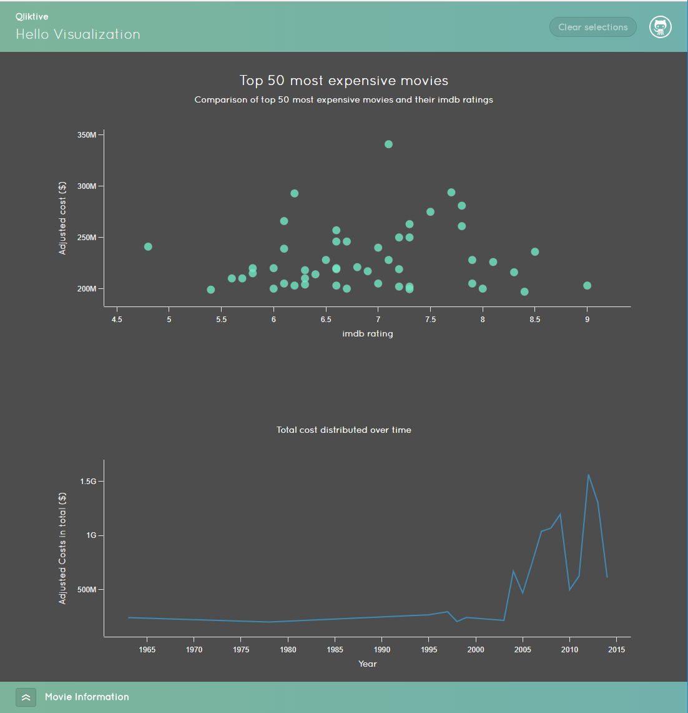

# Get Started

To get started with Qlik Core and Qlik Associative Engine, and to learn the basic concepts,
we provide a number of examples and tutorials.
We created three learning paths to introduce different concepts step by step.

Many of the tutorials contain runnable examples.
The source code is available in separate open source repositories on GitHub.

Before you run these examples, make sure you read the [Licensing](./licensing.md) page.

## Hello Qlik Core!

Start here if you are new to Qlik products and Qlik Associative Engine.

The first set of examples introduce basic operations and usage of the Qlik Associative Engine. Think of
it as the "Hello World" of the engine and the next steps after that.
The Hello Qlik Core examples are divided into three separate parts:

!!! Note
    In the following tutorials, you accept the EULA by defining the `ACCEPT_EULA` environment variable.</br>
    ```bash
    ACCEPT_EULA=yes docker-compose up -d
    ```

- [Hello Engine](./tutorials/hello-engine.md) - Running Qlik Associative Engine as a Docker container and using
    [enigma.js](https://github.com/qlik-oss/enigma.js/) to communicate with it.
- [Hello Data](./tutorials/hello-data.md) - Loading user data into Qlik Associative Engine using
    load script and [halyard.js](https://github.com/qlik-oss/halyard.js).
- [Hello Visualization](./tutorials/hello-visualization.md) - Building visualizations using [picasso.js](https://picassojs.com/).

Once you have completed these tutorials, you should be presented with a result similar to the screenshot below.



## Orchestration

Start here if you have some knowledge about Qlik Associative Engine, its supporting libraries,
and Qlik products, but you are new to container technologies such as Docker:

- [Orchestration](./tutorials/orchestration.md)

This tutorial covers aspects such as:

- Configuring and using a license for Qlik Associative Engine
- Using Qlik Associative Engine in different container orchestration tools
- Using Mira - the Qlik Associative Engine discovery service - when running multiple
    instances of Qlik Associative Engine in a cluster

## In-Depth Tutorials

Start here if you want to cover in-depth tutorials that provide detailed examples of how to work with more specific
aspects of Qlik Core. We recommend that you explore these tutorials in order:

1. [Data loading](./tutorials/data-loading/local-files.md)
    - Loading user data from files into Qlik Associative Engine
1. [Authorization](./tutorials/authorization.md)
    - Using JWTs and JWT validation in Qlik Associative Engine
    - Making sure users only see the data they are supposed to see

## Use Cases

Complementary to our tutorials are the use case examples. These provide complete solutions using Qlik Core that cover
typical problems of production deployments, such as monitoring, logging, scaling, and scheduling strategies.

More information can be found in the [Use Cases](./use-cases.md) section.
