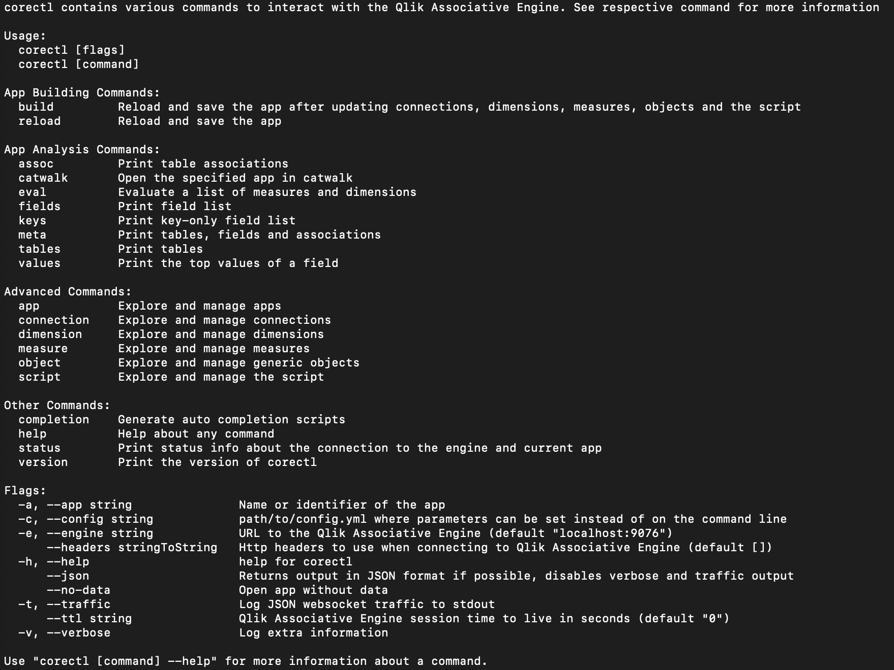

# November 2018

In this November 2018 update we would like to highlight a number of updates in
[catwalk](https://github.com/qlik-oss/catwalk) and [corectl](https://github.com/qlik-oss/corectl).

## Data model experience

In our quest to improve the data modeling experience for developers using Qlik Core, we have continued to work on the
[catwalk](https://github.com/qlik-oss/catwalk) project. Some of the items we've delivered:

* A list of available apps in an engine if no app is addressed
* Color-coded field associations based on key type (primary, foreign and perfect)
* Filterbox supporting the Qlik green-white-gray selection paradigm
* List of available dimensions and measures
* Additional information about tables and fields in tooltips
* Improved stability with bug fixes

To make the load scripting and data modeling flow more fluid, we have also added support in corectl to open the application's
model in catwalk using the current configuration file. As an example:

```qlik
corectl catwalk --config config.yml
```

or set the app directly:

```qlik
corectl catwalk --app my-app.qvf
```

Check it out at [catwalk.core.qlik.com](https://catwalk.core.qlik.com), where catwalk is continuously deployed.

## Command structure in corectl

With a growing number of features in corectl, the top level command structure became complex which then made it hard to get
a good overview of the capabilities. To address this, we have completely overhauled and gathered high level commands
like build, eval and get on the top level, and added the details in sub commands.



As an example, getting a list of objects can be done by executing:

```qlik
corectl get objects
```

and setting a load script can be done by executing:

```qlik
corectl set script loadscript.qvs
```

We also added a requested feature to provide json output (through the --json flag) in our get commands:
apps, dimensions, measures and objects.

As an example you get a list of applications as in json by:

```qlik
corectl get apps --json
```

and a list of dimensions in an application by:

```qlik
corectl -a application get dimensions --json
```

Keep yourself up-to-date by looking for the latest releases in:
[corectl](https://github.com/qlik-oss/corectl)

## Reload log output

With the latest engine version we added support for logging script reloads to `stdout`, just like all other logs in
Qlik Core, instead of storing the data log in a file inside the engine container. This feature is enabled by adding
`ScriptLogVerbosity` to the engine parameters when starting the engine. More information can be found in the
[logging chapter](../services/qix-engine/logging.md#log-types).

## Upcoming

In the upcoming month we will continue hardening our data loading tool corectl. Stay tuned and join the conversation via:

* [slack #qlik-core](https://qlik-branch.slack.com/channels/qlik-core)
* [github](https://github.com/qlik-oss)
