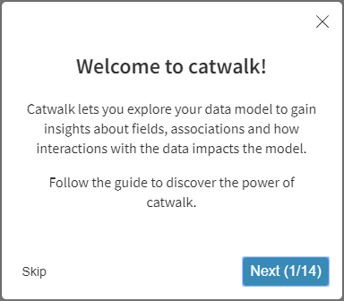

# January 2019

New year, new features, new solutions. Welcome to the first update of the year, the January 2019 update! There are a
couple of important changes and improvements which we hope you will like.

## Data model experience

Our data modelling tool, catwalk, has reached a maturity level where we feel comfortable to move it from experimental
to stable. Since it has continuously been published on [catwalk.core.qlik.com](https://catwalk.core.qlik.com)
you will, if you visited catwalk before, already feel familiar with the look and feel. Here are some of our latest
additions:

### Tool walk-through

The first time you enter the tool you will be greeted with a guide walking you through the different parts of the
application. It will describe how you can analyse your data model, how you interpret the different colours, associations
lines and what the numbers mean.

The guide is based on your chosen application and if you would like to pull it up again in the future you can do so by
right click on the catwalk logo (top right in the application).

### More field descriptions

Another feature we added to provide a better understanding of the data model is extended field information. Previously
you could only reach field information through hoovering over the field card to view a condensed version of the field
data. With the new feature you can also click on the three dots in the top right corner of a field to get a more
descriptive information card with explanation.

## ABAC moving to stable with a breaking change

The API support for [Attribute Based Access Control (ABAC)](../../services/qix-engine/access-control/) in engine has been
around for a while and are ready to be promoted to stable, see
[stability index](../../conventions/api-strategy/#stability-index). The status will change in the next engine released
after the XX February 2019.

Unfortunately this will come with a breaking change in how the applications are stored requiring you to reimport your
application *if* you have already enabled ABAC in your solution. Any application created on an engine with ABAC enabled
prior to this change will stop working.

If you have programmatically created the application, this shouldn't be a problem since you can just recreate the
application in the new engine. However, if you have manually added objects, we suggest you export them before upgrading
to the new engine.

For those of you running the license service you can stay on an engine version until you have made the change but we
urge you to take the step to enable future engine upgrades.

## Improvements in the corectl tool

Corectl has not been forgotten this month but received smaller improvements such as:

* Print event messages in verbose mode.
* Ability to set a free text connection string when configuring a connector.
* Better error messages when working with an engine without correct license (no license and engine has expired).

## Upcoming

In February 2019, we will focus on moving corectl from experimental state to a 1.0.0 release. Stay tuned!

* [slack #qlik-core](https://qlik-branch.slack.com/channels/qlik-core)
* [github](https://github.com/qlik-oss)
