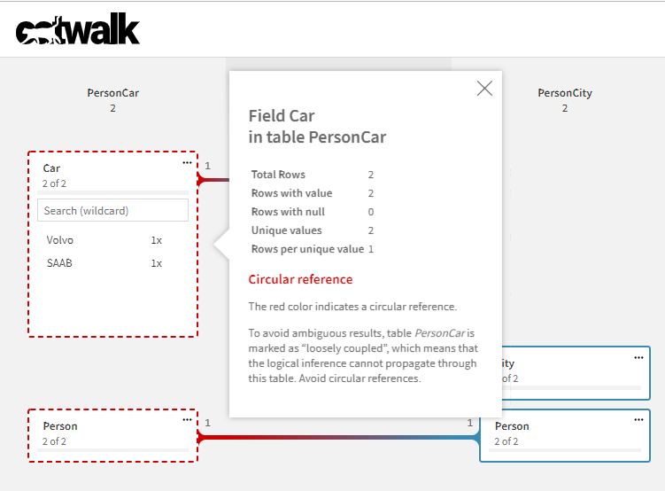

# April 2019

Welcome to the April 2019 Qlik Core update. We're highlighting a couple of important changes and improvements which we
hope you will like.

## Enhancements in catwalk

### Demo app

Looking at the visitor statistics we could see that a lot of people opened and left catwalk without opening a Qlik
application. One possible explanation to this behavior is that these visitors are curious about the tool, but lacking
a running engine prevented them from further exploring. To mitigate this, a
[demo app](https://catwalk.core.qlik.com/?engine_url=wss://apps.core.qlik.com/app/doc/01775889-c700-413f-9b0e-6ba1837c52b0/)
is automatically loaded and can be used as an introduction to the tool.

### Default websocket

If you are mainly working with one engine instance, the new default socket connection feature might be of use.
By clicking on the star, top right in catwalk, the current websocket will be stored in the browser's local storage and
used in future catwalk sessions.


### Add support for selections in "always one selected value" fields

A field with the [property](https://core.qlik.com/services/qix-engine/apis/qix/definitions/#nxfieldproperties)
`qOneAndOnlyOne` will enforce only one selected value. The selection model in catwalk has been updated accordingly.


### Visual support for loosely coupled tables

We have added support for loosely couple tables (tables with a circular reference). Normally this is not intended in
a data model and catwalk will help out by marking the involved fields with a dashed red line.



### Export hypercube data and definition

In one of the feature requests there was an expressed need for exporting hypercube data. It sounded like an
interesting feature so we decided to build support for it and also offer a way to export the hypercube definition to
clipboard. Both features can be found in the hypercube toolbar.


### Save open hypercubes

Something which has bugged us for a while is that all hypercubes created in catwalk gets lost when the window is
refreshed or closed. To prevent this we now store the hypercube definition for each app in the browser's local storage.

### Keep table headers during scrolling

To avoid losing track of table headers when scrolling large apps, the table names are now kept on top. When the table
name disappear, there is no more fields in the table. When having complex applications with a lot of associations, it's
common to have large gaps between the fields and it might be easy to miss the fields in the bottom.


### Various improvements

Apart from the larger fixes we have made a couple of smaller improvements:

* add support for table and field comments
* handle rendering issues when layout isn't retrieved and while loading the layout
* Multiple table-names properly displayed in tool tips
* Fix key field sorting during selection in other fields

## corectl 1.0.0 beta release

On our journey to take corectl into a stable 1.0.0 we have made several significant changes and additions since the 0.5
release. An API specification was created, commands scrutinized and inconsistencies fixed throughout the commands.
Ultimately, we decided upon going from verb-noun to noun-verb to better align with other cli tools, improve
discoverability and to provide a uniform command structure and output. In short this means that all objects (apps,
dimensions, connections, ...) will be found in the command root and relevant actions for these objects a level below.

You can find all new commands in the updated
[documentation](https://github.com/qlik-oss/corectl/blob/master/docs/corectl.md) and try the latest release
[1.0.0 beta release](https://github.com/qlik-oss/corectl/releases/tag/v1.0.0-beta.1).

Among all the changes the following are noteworthy:

### Human readable vs json output

Since we assume corectl will be used interactively and in scripts we default to a human readable table while giving an
option to go for json output for scripting purposes.

```bash
corectl -a gdq.qvf measure ls
+-----------+-----------------+
|    Id     | Title           |
+-----------+-----------------+
| measure-1 | Donation amount |
+-----------+-----------------+

vs
corectl -a gdq.qvf measure ls --json
[
  {
    "qId": "measure-1",
    "title": "Donation amount"
  }
]
```

### Support environment variables in config file

While improving the config file structure we added support for environment variables. This might be usable for you in
scenarios like passing secrets to the connection string or having multiple deployment targets based on environment.

```bash
ENGINE=localhost:19076 corectl build
```

corectl.yml:

```yaml
app: gdq
script: loadscript.qvs
engine: ${ENGINE}
```

Check out this feature and all the supported configuration in
[corectl-config](https://github.com/qlik-oss/corectl/blob/master/docs/corectl_config.md#corectl-config).

### Other improvements

Apart from all the larger improvements we have also delivered:

* Open app without data (using the `--no-data` flag)
* Add bash completion for `rm` commands
* Enforce number of parameters for each command
* Improved config file by providing informative error messages
* Handle objects without data, empty prints and entities which can't be found
* add suggestion on commands on erroneous input
* add `--no-reload` flag to avoid reloading during build
* support for ABAC enabled applications

## hamus.js released as npm package

The hamus.js project has been released as a [npm package](https://www.npmjs.com/package/hamus.js) for easy integration
in new projects.

## Upcoming

In May, we will work on a S3 file connector show casing the new file streaming API in engine. Stay tuned!

* [slack #qlik-core](https://qlik-branch.slack.com/channels/qlik-core)
* [github](https://github.com/qlik-oss)
