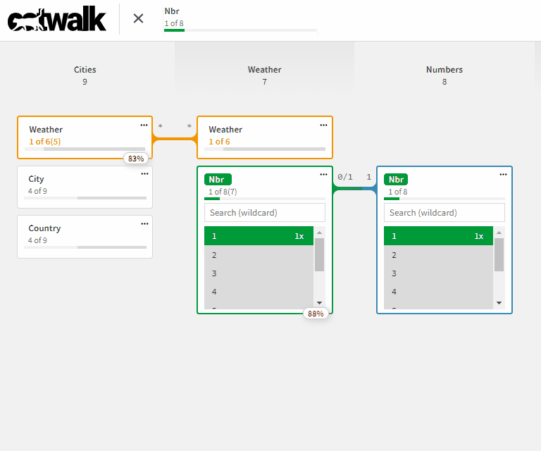
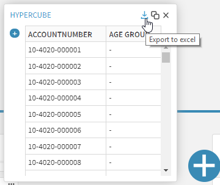

# April 2019

Welcome to the April 2019 Qlik Core update. We're highlighting a couple of important changes and improvements which we
hope you will like.

## Enhancements in catwalk

### Demo app

Looking at the visitor statistics we could see that a lot of people opened and left catwalk without opening a Qlik
application. One possible explanation to the behavior could be a curiosity around the tool and its capabilities but
lacking a running engine or a configured Qlik Sense Enterprise prevented further exploring. To mitigate this we have
have added a
[demo app](https://catwalk.core.qlik.com/?engine_url=wss://apps.core.qlik.com/app/doc/01775889-c700-413f-9b0e-6ba1837c52b0/)
which can be used as an introduction to the tool and is automatically loaded if no engine URL is specified.

### Default web socket

If you are mainly working with one engine instance, using the new default socket connection feature might be of use.
By clicking on the star, top right in catwalk, the current web socket will be stored in the browser's local storage and
used in coming catwalk sessions.

### Add support for selections in "always one selected value" fields

A field with the [property](https://core.qlik.com/services/qix-engine/apis/qix/definitions/#nxfieldproperties)
`qOneAndOnlyOne` will enforce only one selected value. The selection model in catwalk has been updated accordingly.

### Visual support for loosely coupled tables

We have added support for loosely couple tables, i.e. tables with a circular reference. Normally this is not intended in
a data model and catwalk will help out by marking the involved fields with a dashed red line.

### Export hypercube data and definition

In one of the incoming feature requests there was an expressed need for exporting hypercube data. It sounded like an
interesting features so we decided to build support for it but also offer a way to export the hypercube definition to
Clipboard. Both features can be found in the new icons top right in open hypercubes.

### Save open hypercubes

Something which has irritated us for a while is that all hypercubes created in catwalk gets lost when the window is
refreshed or closed. To prevent this we now store the hypercube definition in the browser's local storage.

### Keep table headers during scrolling

Previously, when you navigate in large applications, the table headers were lost which caused some confusions on what
table the fields belonged. With the latest changes we will keep the table names on top as long as there are more fields
in the table. This is especially good if you have a complex application with a lot of association. In these it isn't
uncommon to have tables with large gaps between the fields, making it easy to miss the bottom ones.

### Various improvements

Apart from the larger fixes we have made a couple of smaller improvements:

* add support for table and field comments
* handle rendering issues when layout isn't retrieved and while loading the layout
* Multiple table-names properly displayed in tool tips
* Fix key field sorting during selection in other fields

## corectl 1.0.0 beta release

The rest of the team worked on reaching a 1.0.0 version of corectl. An API specification was created, commands
scrutinized and inconsistencies fixed throughout the commands. In the final work we decided upon going from verb-noun to
noun-verb to better align with other cli tools, improve discoverability and to provide a uniform command structure and
output.

## hamus.js released as npm package

The hamus.js project has been released as a [npm package](https://www.npmjs.com/package/hamus.js) for easy integration
in new projects.

## Upcoming

In May, we're working on SOMETHING. Stay tuned!

* [slack #qlik-core](https://qlik-branch.slack.com/channels/qlik-core)
* [github](https://github.com/qlik-oss)
